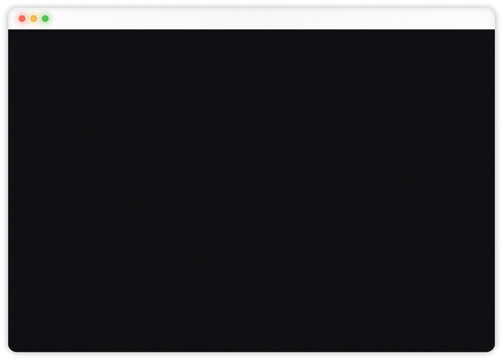

# 3D Developer Portfolio & Blog

A modern, immersive developer portfolio built with React, Three.js, and Tailwind CSS. Features a custom-built blog system with a secure admin dashboard, interactive 3D elements, and a responsive design.

 
*(Note: Replace with an actual screenshot of your hero section)*

## ✨ Features

- **3D Immersive Experience**: Built with **Three.js** and **React Three Fiber**. Features a "Hacker Room" hero scene, interactive 3D avatar animations, and a 3D globe.
- **Responsive Design**: Fully responsive layout optimized for mobile, tablet, and desktop devices.
- **Custom Blog System**: 
  - Integrated blog with markdown support (`react-markdown`).
  - **Admin Dashboard**: Secure `/admin` route to create, edit, and delete posts.
  - **Profile Management**: Update your bio and social links dynamically.
  - Powered by **Turso (LibSQL)**.
- **modern UI/UX**:
  - Glassmorphism effects.
  - Smooth animations with **GSAP**.
  - Dynamic "floating" navbar that auto-hides on scroll.
- **Contact Form**: Functional contact form powered by **EmailJS**.

## 🛠️ Tech Stack

**Frontend:**
- [React](https://react.dev/) (Vite)
- [Three.js](https://threejs.org/) / [React Three Fiber](https://docs.pmnd.rs/react-three-fiber) / [Drei](https://github.com/pmndrs/drei)
- [Tailwind CSS](https://tailwindcss.com/)
- [GSAP](https://gsap.com/)
- [React Globe GL](https://github.com/vasturiano/react-globe.gl)

**Backend / Data:**
- [Turso](https://turso.tech/) (LibSQL) - Serverless SQLite database for blog content.
- [EmailJS](https://www.emailjs.com/) - Client-side email sending.

## 🚀 Getting Started

Follow these steps to set up the project locally.

### Prerequisites
- Node.js (v18+ recommended)
- npm or yarn

### Installation

1.  **Clone the repository:**
    ```bash
    git clone https://github.com/monty0007/ThreeJS.git
    cd portfolio
    ```

2.  **Install dependencies:**
    ```bash
    npm install
    ```

3.  **Configure Environment Variables:**
    
    This project uses environment variables for the database connection and admin authentication.
    
    - Create a `.env` file in the root directory.
    - Copy the keys from `sample.env` and fill in your values.

    ```bash
    cp sample.env .env
    ```

    **Required Variables:**
    - `VITE_TURSO_DB_URL`: Your Turso database URL.
    - `VITE_TURSO_AUTH_TOKEN`: Your Turso authentication token.
    - `VITE_ADMIN_PASSWORD`: A secure password for accessing the `/admin` dashboard.

    > **Note:** The `.env` file is ignored by git to keep your secrets secure.

4.  **Run the development server:**
    ```bash
    npm run dev
    ```

5.  **Open your browser:**
    Navigate to `http://localhost:5173` to view the site.

## 📂 Project Structure

```
src/
├── assets/         # Static assets (images, icons)
├── components/     # Reusable UI components (buttons, 3D models wrapper, etc.)
├── constants/      # Static data (nav links, work experience, etc.)
├── context/        # React Context (AuthContext, BlogContext)
├── hooks/          # Custom hooks
├── lib/            # Utilities (Turso client)
├── sections/       # Main page sections (Hero, About, Blog, etc.)
└── App.jsx         # Main application component & Routing
```

## 🔐 Admin Access

To access the blog admin panel:
1.  Navigate to `/login`.
2.  Enter the password you configured in `VITE_ADMIN_PASSWORD`.
3.  Once logged in, you will be redirected to `/admin` where you can manage posts and your profile.

## 🤝 Contributing

Contributions are welcome! Please feel free to submit a Pull Request.

## 📄 License

This project is open source and available under the [MIT License](LICENSE).

---

**Developed by [Manish Yadav](https://github.com/monty0007)**
